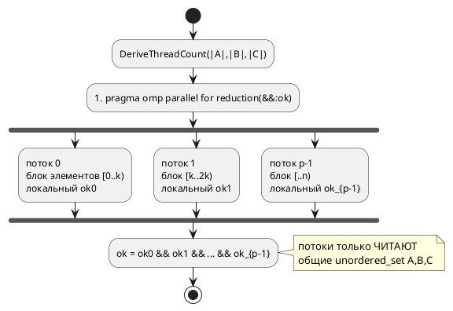

# Лабораторная работа №5

## Тема

Разработка параллельных программ с использованием OpenMP.
Индивидуальный вариант №10: **отношения множеств**.

## Постановка задачи

Даны три множества целых положительных чисел `A`, `B`, `C`.
Определить, является ли множество `C`:

- объединением `A ∪ B`;
- пересечением `A ∩ B`;
- разностью `A \ B`;
- разностью `B \ A`.

Особенность варианта: **количество потоков не является параметром
задачи**, а определяется исходя из мощностей множеств `|A|, |B|, |C|`.
При параллельной реализации нужно избегать ситуаций, когда несколько
потоков изменяют одни и те же общие данные.

## Структура

```
lab5/
├── include/
│   ├── IntSet.h         — множество целых чисел (вектор + хеш для O(1)-поиска)
│   └── SetRelations.h   — API проверки четырёх отношений
├── src/
│   ├── setrel.cpp       — serial- и parallel-реализации (OpenMP)
│   └── main.cpp         — режимы demo / auto / bench (+ выгрузка CSV)
├── tests/test_setrel.cpp
├── analysis/
│   ├── plot_results.py  — Python-скрипт: таблица + графики по замерам
│   └── requirements.txt — зависимости скрипта (matplotlib)
├── results/             — генерируемые таблица и графики (создаётся скриптом)
├── CMakeLists.txt
└── Dockerfile
```

## API

```cpp
struct setrel::Relations {
    bool is_union;         // C == A ∪ B
    bool is_intersection;  // C == A ∩ B
    bool is_diff_ab;       // C == A \ B
    bool is_diff_ba;       // C == B \ A
};

// Сколько потоков взять, исходя из суммарной мощности множеств.
int setrel::DeriveThreadCount(size_t sizeA, size_t sizeB, size_t sizeC);

setrel::Relations setrel::CheckRelationsSerial(const IntSet& a,
                                               const IntSet& b,
                                               const IntSet& c);

// threads <= 0  →  число потоков выводится из мощностей множеств.
setrel::Relations setrel::CheckRelationsParallel(const IntSet& a,
                                                 const IntSet& b,
                                                 const IntSet& c,
                                                 int threads = 0);
```

## Идея алгоритма

Равенство множеств `C` и `S = op(A, B)` проверяется через **двустороннее
включение** `C ⊆ S` и `S ⊆ C`, выраженное только через проверки
принадлежности — **без построения** самого множества `S`:

```
C == A∪B :  (∀c∈C: c∈A ∨ c∈B) ∧ (∀a∈A: a∈C) ∧ (∀b∈B: b∈C)
C == A∩B :  (∀c∈C: c∈A ∧ c∈B) ∧ (∀a∈A: a∉B ∨ a∈C)
C == A\B :  (∀c∈C: c∈A ∧ c∉B) ∧ (∀a∈A: a∈B ∨ a∈C)
C == B\A :  (∀c∈C: c∈B ∧ c∉A) ∧ (∀b∈B: b∈A ∨ b∈C)
```

Каждое условие `∀x∈X: P(x)` — это AND-редукция булева предиката по
элементам одного множества. Проверка принадлежности `x ∈ A` выполняется
за `O(1)` через `std::unordered_set`.

## Особенности и нюансы

- **Два представления множества.** `IntSet` хранит элементы и в векторе
  (`Elements()` — по нему идёт распараллеливаемый обход), и в
  `unordered_set` (`Contains()` — поиск за `O(1)`). Дубликаты во входных
  данных автоматически отбрасываются.
- **Нет гонок данных.** Тело параллельного цикла только **читает** общие
  хеш-множества (одновременное чтение неизменяемого контейнера
  безопасно) и пишет в **приватную** для каждого потока редукционную
  переменную. Общие данные никем не изменяются — критические секции и
  атомики не нужны.
- **AND-редукция через OpenMP.** Используется
  `#pragma omp parallel for reduction(&& : ok)`: у каждого потока своя
  копия `ok`, по завершении они объединяются логическим «и».
- **`schedule(static)`** — все элементы равнотрудоёмки (один `O(1)`-поиск),
  поэтому статическое расписание оптимально без накладных расходов
  `dynamic`.
- **Число потоков из мощностей множеств.** `DeriveThreadCount` берёт
  примерно один поток на каждые 100 000 элементов суммарной работы
  `|A|+|B|+|C|`, ограничивая результат сверху `omp_get_max_threads()`.
  Это и есть «количество потоков не является параметром задачи».
- **Короткое замыкание.** Цепочки `&&` между включениями: если первое
  ложно, остальные обходы не выполняются — лишней работы нет.
- **Размер не кратен числу потоков.** `schedule(static)` сам корректно
  делит диапазон при некратной длине (см. тест с 7 элементами на 3, 4
  и 8 потоках).

## UML: схема потоков

Распараллеливание каждой проверки `∀x∈X: P(x)` (fork-join):



Каждый поток обрабатывает свой непрерывный блок элементов
(`schedule(static)`), держит приватный результат и в точке join они
сворачиваются логическим «и». Общая память (множества `A`, `B`, `C`)
используется только на чтение.

## Запуск

```bash
cmake -S . -B build
cmake --build build

# Наглядный пример на маленьких множествах
./build/setrel_app demo

# Случайные A,B размера N, C = A∪B; потоки выбираются из мощностей
./build/setrel_app auto 200000

# Таблица время/ускорение/эффективность для N = Nmax/8 .. Nmax
./build/setrel_app bench 1600000

# То же с выгрузкой замеров в CSV
./build/setrel_app bench 1600000 results/results.csv

# Автотесты
./build/setrel_tests
```

В Docker:

```bash
docker build -t lab5 .
docker run --rm lab5
```

## Автоматическое построение таблицы и графиков

Скрипт `analysis/plot_results.py` запускает `setrel_app bench`, читает
CSV и генерирует в директорию `results/`:

- `results.csv` — сырые замеры (длинный формат: строка на пару N×threads);
- `results.md` — сводная таблица в Markdown;
- `time_vs_n.png` — время работы от мощности множеств `N`;
- `speedup_vs_n.png` — ускорение `S(p)` от `N`;
- `efficiency_vs_n.png` — эффективность `E(p) = S(p)/p` от `N`.

```bash
# Один раз поставить зависимости
pip install -r analysis/requirements.txt

# Собрать проект, затем построить таблицу и графики
cmake --build build
python analysis/plot_results.py -n 1600000

# Построить только графики по уже готовому CSV, не запуская бенчмарк
python analysis/plot_results.py --no-run --csv results/results.csv
```

## Анализ

| Метрика          | Формула              | Комментарий |
|------------------|----------------------|-------------|
| Сложность serial | `T1 = O(|A|+|B|+|C|)` | по одному `O(1)`-поиску на элемент |
| Сложность parallel | `Tp = O(T1 / p)`   | при идеальном балансе |
| Ускорение        | `S(p) = T1 / Tp`     | измеряется в `bench` |
| Эффективность    | `E(p) = S(p) / p`    | насколько близко к 1 |
| Стоимость        | `C(p) = p · Tp`      | суммарное процессорное время |

В режиме `bench` приложение печатает таблицу со временем
последовательной и параллельной (1, 2, 4, 8 потоков) реализаций,
ускорением `S(p)` и эффективностью `E(p)`. По закону Амдала ускорение
ограничено долей последовательного кода; на маленьких `N` параллельная
версия может проигрывать из-за накладных расходов на fork/join.

## Тесты

`setrel_tests` проверяет:

- распознавание всех четырёх отношений на маленьком примере и случай,
  когда `C` не совпадает ни с одним из них;
- независимость результата от порядка и дубликатов во входных данных;
- пустое пересечение (`A ∩ B = ∅`);
- совпадение параллельной и последовательной версий на случайных данных,
  в том числе при числе потоков, **не кратном** мощности множеств (7 на
  3, 4, 8 потоков);
- корректность на более крупных случайных множествах (по 500 элементов);
- `DeriveThreadCount` возвращает положительное число потоков.
